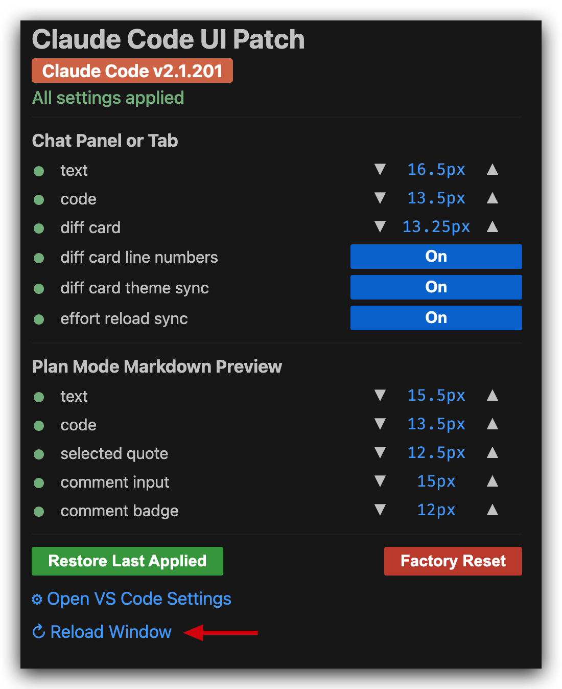
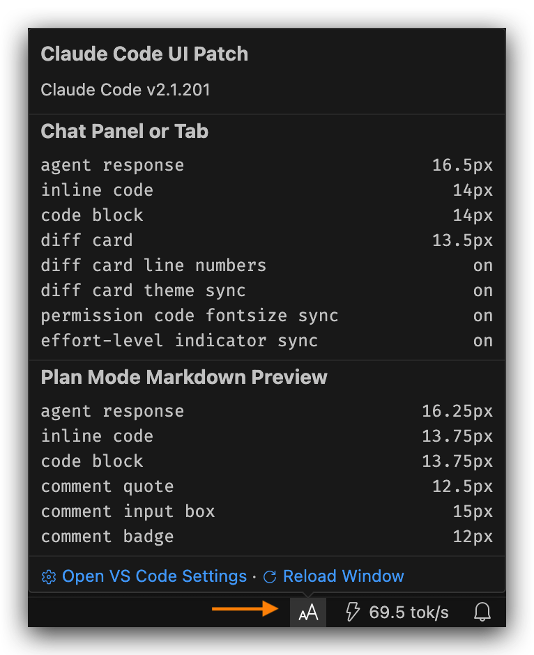

# Smarts Claude Manager

Patch Claude Code VS Code extension UI to provide finegrained settings for various UI details (font sizes, code blocks, diff cards, and more).

## Supported Versions

| Claude Code | Smarts Claude Manager |
| ----------- | ---------------------- |
| 2.1.201+    | 2.0.x                  |

## Every Knob, One Panel

|                Configuration Panel                |                     Status Bar Item                     |
| :-----------------------------------------------: | :-----------------------------------------------------: |
|  |         |
|     Adjust the knobs, then **Reload Window**      | Hover the `aA` to show summary, and click to open panel |

The same controls also dock into the Activity Bar as a sidebar view, so you can keep them
visible alongside your editor instead of a floating tab:

|                                  Activity Bar Sidebar                                 |
| :------------------------------------------------------------------------------------: |
|                                                    |
| The Smarts Claude Manager icon in the Activity Bar opens the identical panel, docked |

The panel lays its content out in a responsive grid — 15 feature checkboxes, the Chat Panel
or Tab knobs, and the Plan Mode Markdown Preview knobs each in their own column on a wide
window, collapsing down to a single column in the narrow sidebar.

1. Open the configuration panel  
   Press `Cmd+Shift+P` / `Ctrl+Shift+P` (or `F1`) to open the Command Palette, then run **Smarts Claude Manager: Open Panel**. Or alternatively, click the `aA` item at the far right of the status bar, or click the Smarts Claude Manager icon in the Activity Bar to open the same controls docked in the sidebar.
2. Modify the settings.  
   The yellow light in front of the item and the yellow highlight of the status bar icon will indicate that a **Reload Window** is needed in order for the configurations to fully apply.
3. **Reload Window**  
   Click it at the bottom of the panel for the changes to take effect. Or alternatively, open the Command Palette, then run **Developer: Reload Window**.
4. Repeat until satisfied.

## What This Extension Patches

Settings live under the `smartsClaudeManager.*` namespace (prefix omitted below) and each defaults to Claude Code's native value. The tree shows every knob, what it targets, and what scales with what: an indented child follows its parent until you give it a value.

```text
chat.fontSize & chat.fontFamily        # native VS Code settings, shared by every chat extension
   │                                   # therefore, this patch does NOT override them
   ├── input box
   ├── interface chrome (buttons, headers, token counts)
   ├── your messages + attachment chips (e.g. image.png)
   └── other chat extensions (Codex, Copilot, ...)

Chat Panel and Tab                     # agent messages only
   ├── chatHistoryFontSize             # agent message text, 0 -> follows chat.fontSize
   ├── chatHistoryFontFamily           # agent message font, empty -> native UI font
   ├── chatCodeblockFontSize           # fenced code blocks (stay monospace)
   │      └── chatCodeInlineFontSize   # inline code, 0 -> follows chatCodeblockFontSize
   └── diff cards                      # Edit / MultiEdit tool cards + expand modal
          ├── chatDiffCardFontSize     # diff code size
          ├── chatDiffCardLineNumbers  # +/- gutter line numbers if On
          └── chatDiffCardThemeSync    # follow VS Code light/dark theme if On

Plan Mode Markdown Preview
   ├── planPreviewFontSize             # preview text (headings scale with it)
   ├── planPreviewFontFamily           # preview font, empty -> native
   ├── planPreviewCodeblockFontSize    # fenced code blocks (stay monospace)
   │      └── planPreviewCodeInlineFontSize      # 0 -> follows planPreviewCodeblockFontSize
   └── select-and-comment UI
          ├── planPreviewCommentInputFontSize    # comment box text
          ├── planPreviewCommentInputRows        # comment box height in rows, 0 -> native
          ├── planPreviewCommentQuoteFontSize    # selected-text quote
          └── planPreviewCommentBadgeFontSize    # comment badge (14px circle, keep <= 12)

Behavior
   ├── chatShowMoreAndLessAlign        # "left" / "right", empty "" -> native
   ├── chatPermissionCodeMatchChatCodeblock      # chatCodeblockFontSize (On) or chat.fontSize (Off)
   ├── effortSyncFix                   # push persisted effort level to a reloaded session if On
   └── chatHideUsageWarning            # permanently hide the "X% of your weekly limit" banner if On

Chat Enhancement Features              # always injected; each feature has its own
   │                                   # smartsClaudeManager.feature.<id> on/off setting
   ├── reply           # Reply on selection: quote selected chat text into the prompt
   ├── search           # Chat Search (Ctrl+F)
   ├── datetime         # date/time stamps + day separators on every message
   ├── askquestion      # AskUserQuestion Markdown/newline render fix
   ├── userstyle        # restyle your own messages as a distinct bubble
   ├── blockquote       # restyle Markdown blockquote callouts + tool-interrupt notices
   ├── copybuttons      # per-message date/time + Copy as Markdown/HTML (needs datetime)
   ├── codeblock        # a Copy button on every fenced code block
   ├── toc              # outline panel: jump to any earlier prompt
   ├── export           # export the whole chat to Markdown / HTML / clipboard
   ├── scroll           # jump to the first / latest message
   ├── askcollapse      # collapse/expand the AskUserQuestion dialog
   ├── usercollapse     # expand/collapse icon on long user messages (replaces Show more/less)
   ├── autocontinue     # auto-submit "continue" on a stream-error banner
   ├── draftsave        # autosave/restore the composer's draft text per chat
   └── usernav          # jump between your own messages (up/down)
```

## Using Smarts Claude Manager

- **Panel controls:** sizes use `▼`/`▲`, toggles an On/Off switch, and each row's sync dot shows green (in effect) or yellow (reload needed).
- **Direct edits:** Font families, comment-box rows, and the "Show more/less" button alignment have no panel control, set them in VS Code Settings via direct edits. `smartsClaudeManager.*` settings apply upon a window reload. Example:

  ```json
  {
    // These settings affect ALL native chats, including Claude Code, Codex, Copilot, etc.
    // Therefore, Smarts Claude Manager does not touch them
    // "chat.fontFamily": "default",
    // "chat.fontSize": 15,

    // Chat Panel or Tab (agent messages only) — every one of these has a panel control too;
    // shown here with its shipped default value
    "smartsClaudeManager.chatHistoryFontSize": 0,
    "smartsClaudeManager.chatHistoryFontFamily": "",
    "smartsClaudeManager.chatCodeblockFontSize": 14,
    "smartsClaudeManager.chatCodeInlineFontSize": 0,
    "smartsClaudeManager.chatDiffCardFontSize": 14,
    "smartsClaudeManager.chatDiffCardLineNumbers": true,
    "smartsClaudeManager.chatDiffCardThemeSync": true,

    // Behavior
    "smartsClaudeManager.chatShowMoreAndLessAlign": "",
    "smartsClaudeManager.chatPermissionCodeMatchChatCodeblock": false,
    "smartsClaudeManager.effortSyncFix": false,
    "smartsClaudeManager.chatHideUsageWarning": false,

    // Plan Mode Markdown Preview
    "smartsClaudeManager.planPreviewFontSize": 14,
    "smartsClaudeManager.planPreviewFontFamily": "",
    "smartsClaudeManager.planPreviewCodeblockFontSize": 13,
    "smartsClaudeManager.planPreviewCodeInlineFontSize": 0,
    "smartsClaudeManager.planPreviewCommentInputFontSize": 13,
    "smartsClaudeManager.planPreviewCommentInputRows": 0,
    "smartsClaudeManager.planPreviewCommentQuoteFontSize": 12,
    "smartsClaudeManager.planPreviewCommentBadgeFontSize": 10,

    // Chat Enhancement Features — always injected; each one's only on/off control
    // is its own checkbox in the panel (or this setting), never an in-chat toggle
    "smartsClaudeManager.feature.reply": true,
    "smartsClaudeManager.feature.search": true,
    "smartsClaudeManager.feature.datetime": true,
    "smartsClaudeManager.feature.askquestion": true,
    "smartsClaudeManager.feature.userstyle": true,
    "smartsClaudeManager.feature.blockquote": true,
    "smartsClaudeManager.feature.copybuttons": true,
    "smartsClaudeManager.feature.codeblock": true,
    "smartsClaudeManager.feature.toc": true,
    "smartsClaudeManager.feature.export": true,
    "smartsClaudeManager.feature.scroll": true,
    "smartsClaudeManager.feature.askcollapse": true,
    "smartsClaudeManager.feature.usercollapse": true,
    "smartsClaudeManager.feature.autocontinue": true,
    "smartsClaudeManager.feature.draftsave": true,
    "smartsClaudeManager.feature.usernav": true
  }
  ```

  Every value above is the extension's shipped default — the JSON key is all you need to add
  to VS Code's `settings.json` if you only want to override one or two.

- **Commands:** `Smarts Claude Manager: Open Panel`.

## Chat Enhancements

A pack of 15 chat-webview features (Reply on selection, Chat Search, message date/time
stamps, per-message and per-code-block Copy buttons, an outline/export/scroll toolbar, and
more) is always injected — no master on/off switch.

- The panel (see [Every Knob, One Panel](#every-knob-one-panel)) has a **Chat Enhancement
  Features** section: one real checkbox per feature. Checking/unchecking writes straight to
  its `smartsClaudeManager.feature.<id>` setting (see the tree above for the full id list) and
  re-patches the bundle immediately — the panel is the one place to turn individual
  features on/off; there is no separate control inside the chat itself.
- A feature you turn off still needs the same **Reload Window** step as any other patch
  change to take effect in an already-open chat webview.

## Is the Patch Applied? How Does It Work?

**Checking whether the patch is applied:** open the panel (`Ctrl+Shift+P` / `Cmd+Shift+P` →
**Smarts Claude Manager: Open Panel**, the status bar `aA` item, or the Activity Bar icon).
Each row's sync dot tells you the state:

- **Green dot** — the setting is in effect on disk (patched and current).
- **Yellow dot** — a change is pending; run **Reload Window** for it to take effect.

The panel derives this by reading the actual installed Claude Code extension files
(`extension.js`, `webview/index.js`, `webview/index.css`) from
`<user home>/.vscode/extensions/anthropic.claude-code-<version>/` and comparing their real
on-disk content against your `smartsClaudeManager.*` settings — it is a live read of the
files, not a cached assumption. You can also check manually: open that extension folder and
search the three files for `/*cc-ui-patch:*/` or `/*ccup-*/` — their presence means a patch
has been written there.

**How the patch works, end to end:**

1. **Target files.** Claude Code ships as one versioned folder
   (`anthropic.claude-code-<version>-<platform>`) containing `extension.js` (Plan Mode
   preview webview), `webview/index.css` (chat code-block font and related CSS), and
   `webview/index.js` (the chat Edit-diff card, a Monaco diff editor with hardcoded
   options).
2. **Three kinds of edits.** A *size* swap replaces a hardcoded px number or CSS value
   (e.g. code-block font size). A *toggle* flips a boolean-shaped value (e.g. diff card line
   numbers on/off). An *injection* adds new CSS/JS that doesn't exist natively (e.g. a custom
   font family, or the whole Chat Enhancement Features script block).
3. **Applying.** On extension activation (or whenever you change a setting in the panel),
   each target file is read, every matching patch point is rewritten via its anchor
   regex/marker, and the file is written back **atomically** (staged to a temp file, then
   renamed over the original) so a concurrent reader never sees a half-written file.
4. **Gated by `patchEnabled`.** Auto-apply only runs while `smartsClaudeManager.patchEnabled`
   is `true`. If you've used **Fully Disable Patch**, the extension will not silently
   re-patch the bundle on the next activation.
5. **Reload required.** Claude Code has already loaded the old file contents into memory, so
   a **Reload Window** is needed before a freshly written value actually renders.
6. **Reverting.** Fully Disable Patch (in the panel) rewrites every patched file back to its
   captured native/stock values. This also happens automatically, at the file level, when the
   extension itself is disabled or uninstalled from VS Code — you never end up with a
   permanently patched bundle after removing Smarts Claude Manager.

## Hide the Usage-Limit Warning Banner

`smartsClaudeManager.chatHideUsageWarning` (default off) permanently hides the "You've used
X% of your weekly limit" banner and its "View usage" link — the banner's own `×` only
dismisses it for the current usage window (it reappears on the next update); this setting
suppresses it for good.

## Caveats

- **The patch reverts when Claude Code updates.** Your settings re-apply on the next window reload (reload once more to see them). VS Code may show a one-time "corrupt installation" warning, which is safe to dismiss.
- **`chatHistoryFontSize` / `chatHistoryFontFamily` restyle the agent transcript only** (deliberate design, not a bug). Your own messages, the input box, the interface, and other extensions' chats (Codex, Copilot, etc.) stay native, and can be configured with `chat.fontSize` and `chat.fontFamily`.
- **The floating panel tab and the Activity Bar sidebar are the same controls, just docked differently** — both stay in sync with the same underlying settings, so a change made in one is reflected in the other after a reload.
