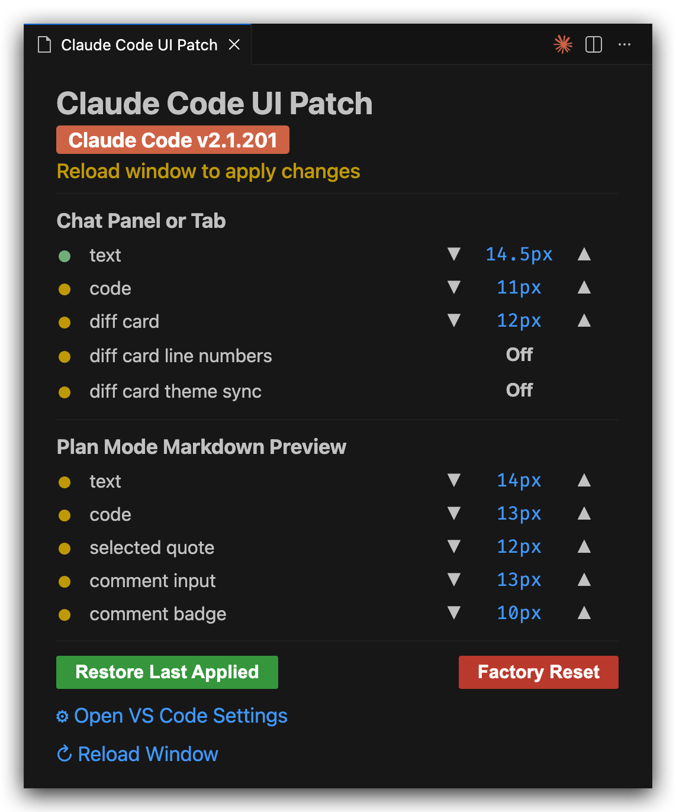
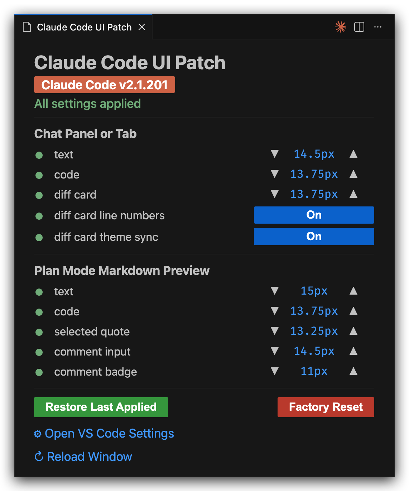

# Claude Code UI Patch

Patch Claude Code VS Code extension UI to provide finegrained settings for various UI details (font sizes, code blocks, diff cards, and more).

## Supported Versions

| Claude Code | UI Patch |
| ----------- | -------- |
| 2.1.201+    | 1.0.x    |

## Every Knob, One Panel

|                               Before                               |                      After                       |
| :----------------------------------------------------------------: | :----------------------------------------------: |
|  |  |
|                   Yellow: Reload window to apply                   |           Green: All settings applied            |

## What This Extension Patches

Claude Code hard-codes a handful of UI details that no setting reaches. This extension edits them in the installed bundle and reverts cleanly on demand.

- **Nothing changes until you ask.** Every setting starts at Claude Code's native value, so installing does nothing on its own. Adjust a size or flip a toggle to change something, reset it to default to revert. Changes apply on save; reload the window to see them.
- **Sticks across updates.** The patch re-applies itself after Claude Code updates, so your settings survive.

### 1. Chat Panel and Tab

| Setting                                     | Native  | Target                                                                 |
| ------------------------------------------- | ------- | ---------------------------------------------------------------------- |
| `chat.fontSize`                             | `~14px` | chat panel/tab text, input, IN/OUT blocks                              |
| `claudeCodeUiPatch.chatCodeblockFontSize`   | `~11px` | chat panel/tab fenced code blocks                                      |
| `claudeCodeUiPatch.chatDiffCardFontSize`    | `12px`  | diff card (Edit/MultiEdit tool cards and their expand modal)           |
| `claudeCodeUiPatch.chatDiffCardLineNumbers` | `off`   | diff-card line numbers, with real `+`/`-` gutter signs                 |
| `claudeCodeUiPatch.chatDiffCardThemeSync`   | `off`   | diff card follows the VS Code light/dark theme                         |
| `claudeCodeUiPatch.effortSyncFix`           | `off`   | syncs the interface effort button and the actual API call effort level |

### 2. Plan Mode Markdown Preview

| Setting                                             | Native | Target                                         |
| --------------------------------------------------- | ------ | ---------------------------------------------- |
| `claudeCodeUiPatch.planPreviewFontSize`             | `14px` | Markdown preview text (headings scale with it) |
| `claudeCodeUiPatch.planPreviewCodeblockFontSize`    | `13px` | code blocks and inline code                    |
| `claudeCodeUiPatch.planPreviewCommentQuoteFontSize` | `12px` | selected-text quote                            |
| `claudeCodeUiPatch.planPreviewCommentInputFontSize` | `13px` | select-and-comment input                       |
| `claudeCodeUiPatch.planPreviewCommentBadgeFontSize` | `10px` | comment badge (fixed 14px circle, keep <= 12)  |

## Using This UI Patch

- **Status bar:** hover for current sizes, click to open the configuration panel.
- **Configuration panel:** per-knob `▼`/`▲` for sizes and an On/Off switch for toggles, each with a leading sync dot (green = in effect, amber = window reload needed), plus Restore Last Applied / Factory Reset / Open Settings / Reload. The native `chat.fontSize` appears here too.
- **Settings:** edit any `claudeCodeUiPatch.*` value; it applies automatically. Reload the window for changes to take effect.
- **Commands:** `Claude Code UI Patch: Open Panel`, `... Restore Font Sizes`.

## Caveats

- **Effort reload sync** (`effortSyncFix`): Claude Code persists `effortLevel` to `~/.claude/settings.json` and the effort button seeds from it, but a freshly spawned session does not re-read it — effort is only pushed live when you toggle the button. So after a reload the button can show `max` while the call silently runs at the default (`high`) until you flip the button. Enabling this toggle makes the init seed also push the persisted level to the session, so the call matches the button without a manual toggle. It mirrors the button's own push path and is opt-in (native behavior by default).
- The patch reverts on Claude Code updates (re-applied on the next window load; reload once more to see it). VS Code may show a one-time "corrupt installation" warning that is safe to dismiss.
- Diff-card line numbers count from the top of the shown change, not from the file: the card only receives the changed snippet, never its position in the file, so true file line numbers aren't available.
- The comment badge sits in a fixed 14px circle, so values above ~12 overflow.
- Targets the highest-version `anthropic.claude-code-*` install found.

## Development

```bash
npm ci                          # install from the lockfile
npm run compile                 # rebuild out/
npx @vscode/vsce package        # build the .vsix
mv claude-code-ui-patch-*.*.*.vsix claude-code-ui-patch-latest.vsix
code --install-extension claude-code-ui-patch-latest.vsix --force
```

Then run **Developer: Reload Window**.
